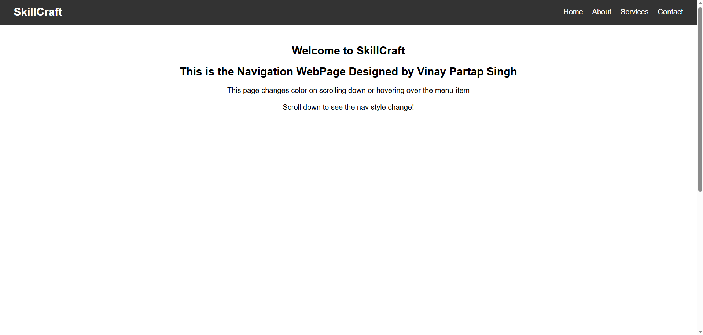

# SCT_WD_Task1 — Interactive Navigation Menu

This is Task 1 for the SkillCraft Technology Web Development Internship.

## ✅ Features

- Fixed navigation bar visible on all pages
- Navigation bar changes **background colour** when the user **scrolls**
- Smooth hover effect that changes **link colour** and adds an underline
- Built using **HTML**, **CSS**, and **JavaScript**

## 📌 How It Works

- **HTML:** Defines the page structure with a header, nav, and some content to scroll.
- **CSS:** Styles the nav bar, hover states, and scroll effect.
- **JavaScript:** Adds/removes a `scrolled` class when the page is scrolled down.

## 🚀 How To Run

1. Clone this repo:
   ```bash
   git clone https://github.com/Vinay-Partap/SCT_WD_Task1.git

2. Open the folder and run index.html in your browser.

3. Scroll down to see the navbar background change.

4. Hover over nav links to see the hover effect.


✨ Technologies Used

a. HTML5
b. CSS3
c. JavaScript (Vanilla)

📸 Screenshots



📚 About
This project is part of the SkillCraft Technology Web Development Internship to practice DOM manipulation, CSS transitions, and responsive design.

Made with ❤️ by Vinay Partap Singh for SkillCraft Technology